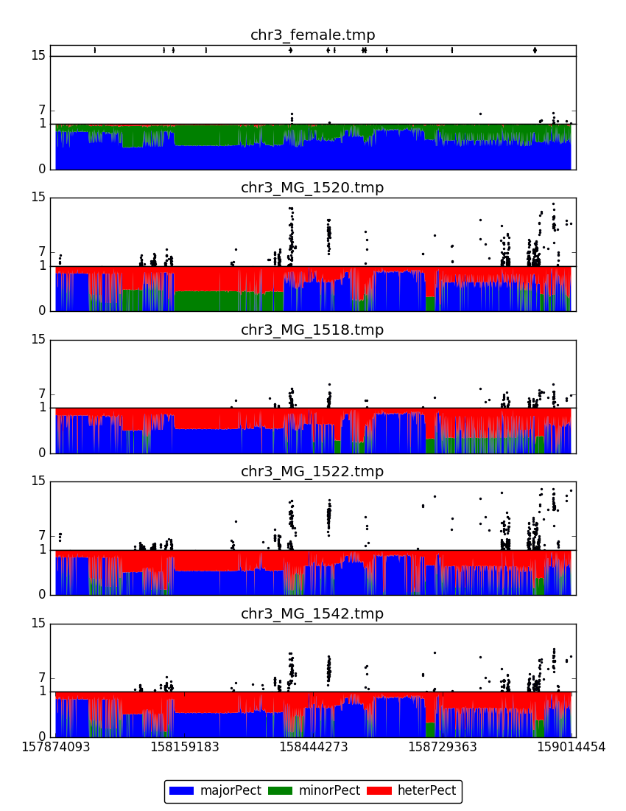

# heterPlotter
## DESCIPTION
*heterPlotter* package can plot heterozygosity information of hapmap(female and F1) files and pvalue information you use the same hapmap file to calculate GWAS, besides it can also draw the relative gene feature on the top of the plot.
## USAGE:
You can run this *heterPlotter* package follow the below instructions!
```
heterPlotter.py [-h] [-g GTF] [-i INTERVAL] [-a ANNO] [-idx INDEX]
                [-hp HAPMAP] [-gw GWAS] [-pmax PVALUEMAX]
                [-pmin PVALUEMIN] [-o OUT]
```
## Essential Options
```shell 
-g/--gtf GTF FILE
This is the gtf file the species you specified.
-i/--interval INTERVAL
This is the interval you specified.Eg: 8:10000-20000.
-a/--anno ANNOTATION FILE
This is the annotation file you should provide.
-idx/--index SNP NUMBER
The number of SNPs you want to specified in each bin. Default: 1000.
-hp/--hapmap HAPMAP CONTAINER
This is the config file which contains the absolute path of hapmap files.
-gw/--gwas GWAS CONTAINER
This is the config file which contains the absolute path of gwas files.
-pmax/--pvalueMax MAX PVALUE
This is the max pvalue you specified to draw the plot. Default is 15.
-pmin/--pvalueMin MIN PVALUE
This is the min pvalue you specified to draw the plot. Default is 5.
-o/--out FIGURE OUT
The output figure you want to specified!
```

Finally you simply run the *heterPlotter* using example data in *data* directory by typing:
```shell
mkdir test
cd test
python ../scripts/heterPlotter.py -g ../data/chr3.gtf -i 3:158397000-158598000 -hp ../data/test.hapmap -gw ../data/test.gwas -a ../data/anno.txt -pmin 7 -pmax 14 -o example.png
```
Then, the example.png, targetGene.anno(annotation of the genes which include in the region you input) and several temporal files are generated!

## Prerequisitions
You will need to install the python packages prerequisitely:

1. [matplotlib(>2.30)](https://matplotlib.org/)
1. [pandas(>0.20)](https://pandas.pydata.org/)

## Features
 1. You can use ```buildIndex.py``` to build index file for your big hapmap file or GWAS file.
    
    ```python buildIndex.py [-h] [-bf BIGFILE] [-idx INDEX] [-ft FILETYPE] [-o OUT]```
    ####```-bf/--bigfile``` HAPMAP/GWAS BIGFILE CONTAINER
    This is the config file which contains the absolute path of hapmap/GWAS files.
    ####```-ft/--fileType``` FILETYPE
    The number of the file type you want to build index.'1' refer to hapmap file, and '2' refer to gwas file.
    ####```-idx/--index``` SNP NUMBER
    The number of SNPs you want to specified in each bin. Default: 1000.

2. You can use ```convertHp2Num.py``` to convert the alphabetic hapmap file to numeric hapmap file.

    ```convertHp2Num.py [-h] [-hp HAPMAP]````
    ####```-hp/--hapmap HAPMAP CONTAINER```
    This is the config file which contains the absolute path of hapmap files ora part section of hapmap file.

## Output
This is the example output of *heterPlotter*


## Issues

1. You may come across the issue as following:

```shell
Traceback (most recent call last):
  File "example.py", line 7, in <module>
    plt.scatter(x, y, s=20)
  File "/home/USER/.virtualenvs/nnet/lib/python2.7/site-packages/matplotlib/pyplot.py", line 3241, in scatter
    ax = gca()
  File "/home/USER/.virtualenvs/nnet/lib/python2.7/site-packages/matplotlib/pyplot.py", line 928, in gca
    return gcf().gca(**kwargs)
  File "/home/USER/.virtualenvs/nnet/lib/python2.7/site-packages/matplotlib/pyplot.py", line 578, in gcf
    return figure()
  File "/home/USER/.virtualenvs/nnet/lib/python2.7/site-packages/matplotlib/pyplot.py", line 527, in figure
**kwargs)
  File "/home/USER/.virtualenvs/nnet/lib/python2.7/site-packages/matplotlib/backends/backend_tkagg.py", line 84, in new_figure_manager
    return new_figure_manager_given_figure(num, figure)
  File "/home/USER/.virtualenvs/nnet/lib/python2.7/site-packages/matplotlib/backends/backend_tkagg.py", line 92, in new_figure_manager_given_figure
    window = Tk.Tk()
  File "/usr/local/lib/python2.7/lib-tk/Tkinter.py", line 1810, in __init__
    self.tk = _tkinter.create(screenName, baseName, className, interactive, wantobjects, useTk, sync, use)
_tkinter.TclError: no display name and no $DISPLAY environment variable
```

Then you can refer to this answer from [stackOverflow](https://stackoverflow.com/questions/37604289/tkinter-tclerror-no-display-name-and-no-display-environment-variable).

## Notes
1. The test.hapmap/test.gwas file is the path container of your hapmap files, one path per line, like below:
> /home/xufeng/xufeng/lab_member/jiangshan/heterPlotter/chr3_female
> /home/xufeng/xufeng/lab_member/jiangshan/heterPlotter/chr3_MG_1522
> 
> ...
## Debug
Any questions are appreciated, you can contact me via: crazyhsu9527@gmail.com or QQ:369630596.

